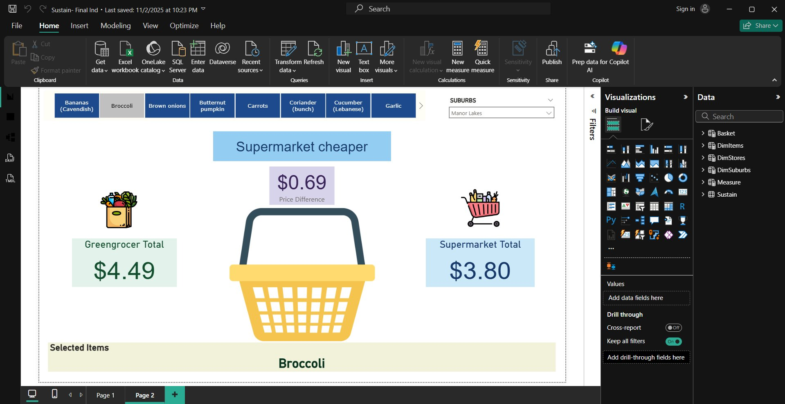
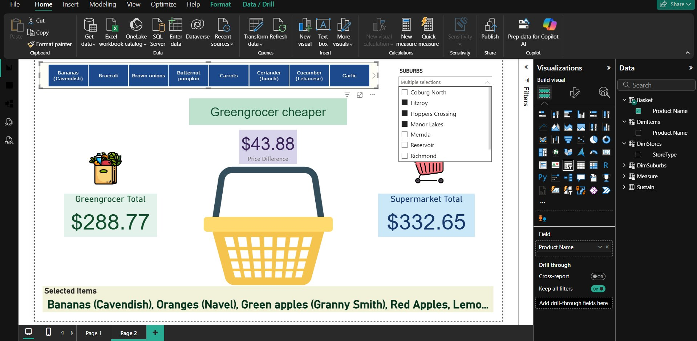

# Sustain---Food-Affordability
# 🛒 Fresh Food Affordability & Price Stability Analysis
### Melbourne, Victoria — Sustain Australia × RMIT University | Aug – Nov 2025

---

## 📌 Project Overview

One in five Australians cannot afford sufficient nutritious food. Yet most people don't know that the same tomatoes can cost 50% more depending on which suburb they shop in — or which type of store they walk into.

This project analyses **fresh produce pricing across 16 stores in 8 Melbourne suburbs**, comparing greengrocers and supermarkets across areas with varying levels of socioeconomic disadvantage (measured via the **SEIFA IRSAD index**). The goal: turn complex pricing data into clear, interactive visuals that Sustain Australia can use for community advocacy and policy engagement.

Delivered as part of the **Applied Research Project (MATH2191)** at RMIT University, in industry partnership with **Sustain: The Australian Food Network**.

---

## ❓ Problem Statement

Food costs more where people earn less — studies prove it. But most of that evidence sits in dense academic reports that everyday people, local councils, and community advocates never read.

This project bridges that gap: real prices from real shops in real suburbs, visualised so the inequity is impossible to ignore.

---

## 🎯 Objectives

- Collect standardised price-per-kg data from supermarkets and greengrocers across 4 Melbourne LGAs
- Quantify affordability and value-for-money variation by suburb, store type, and SEIFA rank
- Measure price volatility (coefficient of variation) across product categories using statistical testing
- Build an interactive Power BI dashboard usable by non-technical stakeholders
- Deliver actionable insights to Sustain Australia to support food equity advocacy

---

## 🗂️ Data & Scope

| Dimension | Detail |
|---|---|
| Stores visited | 16 (1 supermarket + 1 greengrocer per suburb) |
| Suburbs | Reservoir, Thomastown, Coburg North, Mernda, Hoppers Crossing, Manor Lakes, Richmond, Fitzroy |
| LGAs | Whittlesea, Darebin, Wyndham, City of Yarra |
| Products | Fruits, vegetables, aromatics — bananas, apples, oranges, tomatoes, garlic, ginger, lemongrass, coriander, red long chilies, lemons, carrots, cucumber, iceberg lettuce, pak choy, spring onion, leek, butternut pumpkin, red capsicum, brown onions, potatoes |
| Unit of analysis | Price per kilogram (AUD/kg) |
| Socioeconomic index | SEIFA IRSAD ranks (1 = most disadvantaged → 10 = least) |
| Collection period | Early September 2025 (single cross-sectional snapshot) |

---

## 🛠️ Tools & Technologies

| Tool | Purpose |
|---|---|
| **R (RStudio)** | Data cleaning, transformation, statistical analysis, and visualisation |
| **Power BI** | Interactive 6-page dashboard with DAX measures and data modelling |
| **Excel** | Data entry, cleaned dataset storage, and export |
| **DAX** | Custom measures — basket cost, price gap %, CV%, value-for-money comparisons |

**R packages:** `readxl`, `dplyr`, `stringr`, `tidyr`, `ggplot2`, `car`, `writexl`, `janitor`

---

## 📁 Repository Structure

```
sustain-food-affordability/
│
├── data/
│   ├── Sustain_Final_edited.xlsx           # Cleaned master dataset
│   ├── PriceVariation_Suburb_Summary.xlsx  # Suburb-level CV% summary
│   └── SUSTAIN_Stability_Analysis.xlsx     # Exported stability analysis results
│
├── analysis/
│   └── ARP_GG_analysis.R                   # Full R script — cleaning, stats, visualisations
│
├── dashboard/
│   └── sustain_dashboard.pbix              # Power BI report (6-page interactive dashboard)
│
├── report/
│   └── Final_Report.pdf                    # Full academic report submitted to RMIT
│
└── README.md
```

> ⚠️ Raw receipt-level data is not publicly available due to client data privacy. The cleaned dataset (`Sustain_Final_edited.xlsx`) is included as the starting point for analysis.

---

## 🔧 Methodology

### 1. Data Cleaning (R)

The raw receipt-level dataset was cleaned and standardised in R:

```r
# Parse price per kg from mixed-format text strings
parse_num <- function(x){
  x <- gsub(",", "", as.character(x))
  m <- stringr::str_extract(x, "\\d*\\.?\\d+")
  as.numeric(m)
}
df$price_perkg_num <- parse_num(df$price.per.kg.on.reciept)

# Normalise store type labels
df$store_type <- case_when(
  str_detect(df$Store.type, "green") ~ "Greengrocer",
  str_detect(df$Store.type, "super|coles|woolworth") ~ "Supermarket",
  TRUE ~ "Other"
)

# Filter to comparable products only (sold by both store types)
comp_products <- df_clean %>%
  distinct(product, store_type) %>%
  count(product) %>%
  filter(n == 2) %>%
  pull(product)
```

### 2. Key Metrics

| Metric | Formula | Purpose |
|---|---|---|
| Price per kg | Amount paid ÷ weight (kg) | Headline affordability |
| Weight per dollar | Weight (kg) ÷ amount paid | Value-for-money comparison |
| Price gap % | (Supermarket − Greengrocer) ÷ Greengrocer × 100 | Relative price difference |
| CV% | SD ÷ Mean × 100 | Price volatility / stability |

### 3. Statistical Testing — Brown-Forsythe Test

A **Brown-Forsythe test** (Levene's test centred on median) was applied per product on log-transformed prices to test whether variance differences between store types were statistically significant:

```r
bf_results <- df_comp %>%
  mutate(log_price = log(price_perkg_num)) %>%
  group_by(product) %>%
  group_modify(~{
    fit <- try(leveneTest(log_price ~ store_type, data = .x, center = median), silent = TRUE)
    if(inherits(fit, "try-error")) return(tibble(bf_stat = NA, bf_p = NA))
    tibble(bf_stat = fit[1, "F value"], bf_p = fit[1, "Pr(>F)"])
  }) %>%
  ungroup()

stability_table <- cv_compare %>%
  left_join(bf_results, by = "product") %>%
  mutate(significant = if_else(!is.na(bf_p) & bf_p < 0.05, "Yes", "No"))
```

### 4. Power BI Dashboard & DAX

Cleaned data was modelled in Power BI with dimension tables and custom DAX measures. The **BasketBuilder** feature lets users select any combination of products and instantly compare total cost at greengrocers vs supermarkets:

```dax
-- Greengrocer basket total for selected items
Basket Greengrocer =
VAR items = VALUES(Basket[Product Name])
RETURN SUMX(items,
  CALCULATE([Price (Chosen Grain)],
    Sustain[StoreType] = "Greengrocer",
    TREATAS(items, DimItems[Product Name])))

-- Label showing which store is cheaper
Basket Cheaper Label =
VAR g = [Basket Greengrocer]
VAR s = [Basket Supermarket]
RETURN IF(ISBLANK(g) || ISBLANK(s), "Select items",
  IF(g < s, "Greengrocer cheaper", IF(g > s, "Supermarket cheaper", "Tie")))
```

Dashboard page flow: **Price levels → Value for money → Volatility → SEIFA context → BasketBuilder**

---

## 📊 Key Findings

### 1. Greengrocers are significantly cheaper — especially for aromatics

| Product | Greengrocer ($/kg) | Supermarket ($/kg) | Difference |
|---|---|---|---|
| Lemongrass | $270 | $853 | +216% |
| Garlic | $201 | $273 | +36% |
| Ginger | $206 | $232 | +13% |

Staple items (bananas, potatoes, brown onions) showed minimal variation between store types.

### 2. Disadvantaged suburbs get significantly better value at greengrocers

| Suburb | SEIFA Rank | Greengrocer (kg/$) | Supermarket (kg/$) |
|---|---|---|---|
| Thomastown | 1 (most disadvantaged) | 0.215 | 0.174 |
| Reservoir | 3 | 0.300 | 0.165 |
| Manor Lakes | 7 | 0.173 | 0.188 |
| Richmond | 7 | 0.149 | 0.197 |

In high-SEIFA (affluent) suburbs, supermarkets matched or outperformed greengrocers — reflecting boutique greengrocer positioning and lower price sensitivity among consumers.

### 3. Supermarkets show higher suburb-level price variation in 7 of 8 suburbs
The suburb-level CV% chart showed supermarkets had higher overall price variation than greengrocers across almost all suburbs — with CV% ranging from 150–180% at supermarkets vs 80–125% at greengrocers.

### 4. Lemongrass had the largest stability gap (CV difference > 0.75)
Of the top 20 products ranked by CV difference, greengrocers were more price-stable for the majority. Spring onion and leek were the main exceptions where supermarkets showed lower variance.

---

## 🖥️ Dashboard Preview

### BasketBuilder — Single Item, Single Suburb

*Selecting Broccoli in Manor Lakes: Supermarket ($3.80) is cheaper than Greengrocer ($4.49) by $0.69 — one of the few cases where supermarkets win.*

### BasketBuilder — Full Basket, Multiple Suburbs

*Selecting a full fruit basket across Fitzroy, Hoppers Crossing and Manor Lakes: Greengrocer total ($288.77) vs Supermarket ($332.65) — a $43.88 saving at the greengrocer.*

> 📸 Further screenshots covering price level analysis, volatility (CV%), and SEIFA comparisons coming soon.

---

## 💡 Policy Recommendations

1. **Live affordability monitoring** — council-integrated dashboards tracking regional vs metro pricing gaps in real time
2. **Logistics subsidies** for independent greengrocers to reduce cost inflation in outer suburbs
3. **Incorporate volatility metrics** into food security reporting alongside average cost figures
4. **Zoning policy** to co-locate greengrocers near public transport corridors in low-SEIFA suburbs

---

## 👤 My Contributions

This was a 4-person team project. My specific contributions were:

- **Data cleaning and transformation in R** — parsing mixed-format price strings, normalising store type labels, filtering to comparable product sets, and preparing the cleaned export for Power BI
- **Price stability analysis** — computed CV% per product and store type, applied Brown-Forsythe statistical tests, and produced the full stability table exported to `SUSTAIN_Stability_Analysis.xlsx`
- **Visualisations in R** — CV difference bar chart (top 20 products), unit price spread boxplots by retailer, and suburb-level CV% grouped bar chart
- **BasketBuilder concept** — contributed to the design of the interactive basket comparison feature in Power BI
- **Stakeholder presentation** — presented findings and dashboard to industry supervisors at Sustain Australia

---

## 🤝 Acknowledgements

- **Industry Supervisors:** Dr. Rachael Walshe & Mia Cox — Sustain: The Australian Food Network
- **Academic Supervisor:** Dr. Shuwen Hu — RMIT University
- **Team Members:** Kawal Kaur, Pooja Dhandhi, Saad Hassan Khera

---

## 📄 License

Completed for academic and industry research purposes in partnership with Sustain: The Australian Food Network. Raw receipt-level data is not publicly available due to client privacy considerations.
